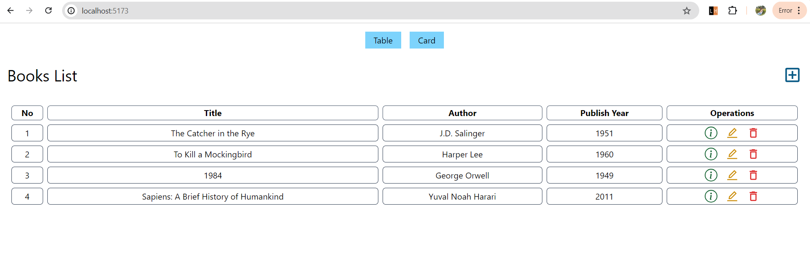
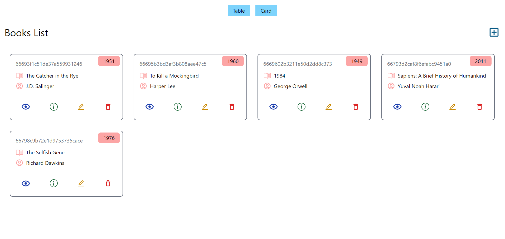
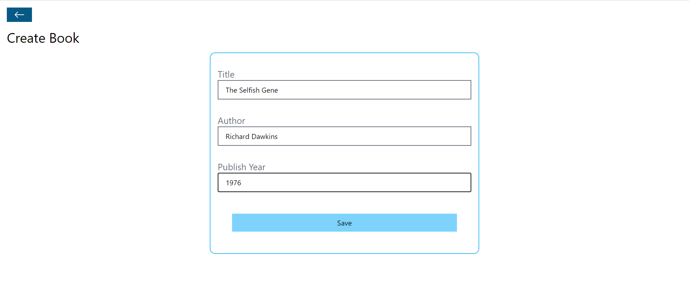
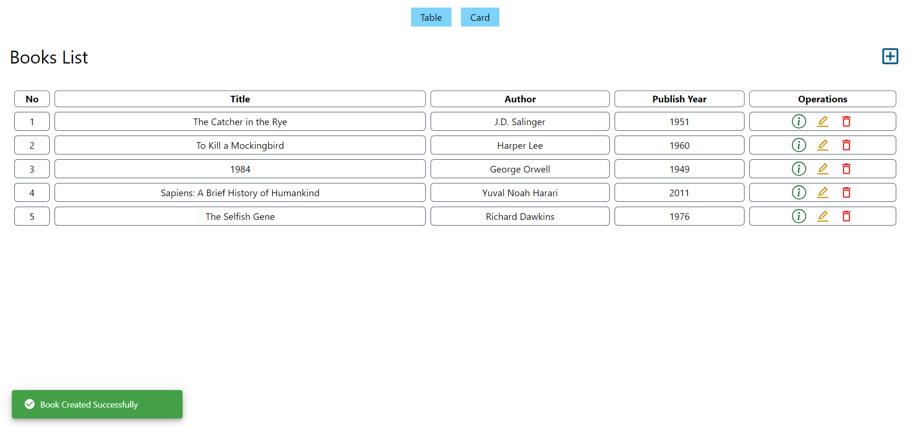
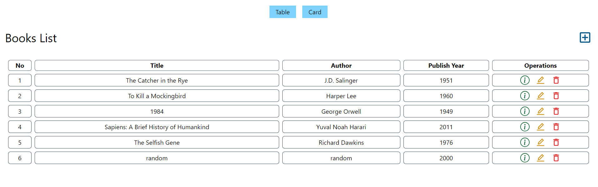
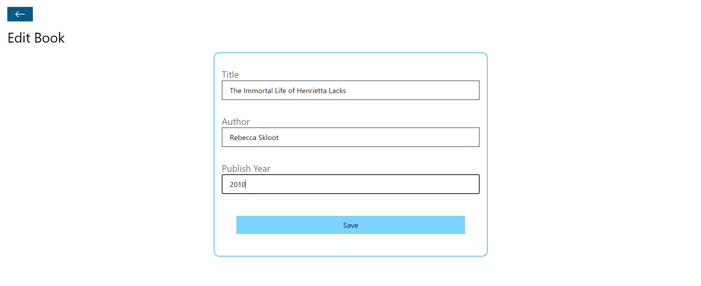
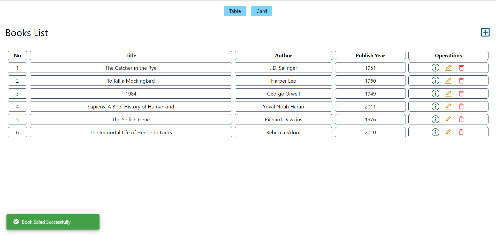
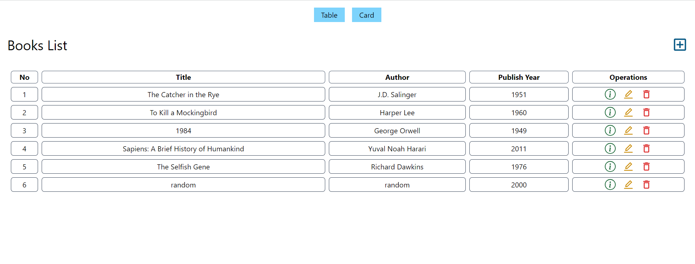
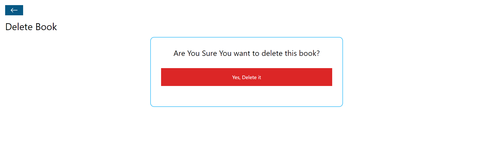
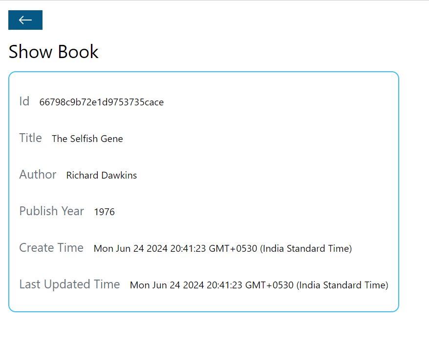

# BookStore

This repository contains a full-stack web application for a BookStore built with the MERN stack (MongoDB, Express.js, React.js, Node.js).

## Features

- **Backend**:
  - RESTful API built with Node.js and Express.js
  - MongoDB database integration for storing book data

- **Frontend**:
  - Single-page application (SPA) using React.js
  - Responsive design using Tailwind CSS

## Folder Structure
BookStore/  
├── backend/ # Backend Node.js application  
│ ├── controllers/  
│ ├── models/  
│ ├── routes/  
│ └── ...  
└── frontend/ # Frontend React application  
├── public/  
├── src/  
├── .gitignore  
├── package.json  
└── ...  

## Installation
To run this project locally, clone the repository and follow these steps:

1. **Backend Setup**:
   ```bash
   cd backend
   npm install
   npm start

2. **Frontend Setup**:
   ```bash
   cd frontend
   npm install
   npm run dev
   
3. **Open your browser and go to http://localhost:3000 to view the application.**

## Technologies Used

### Backend:

- Node.js
- Express.js
- MongoDB
- Mongoose

### Frontend:

- React.js
- Axios
- Tailwind CSS

### Home Page



### Add Book



### Edit Book




### Delete Book




### Show Book

